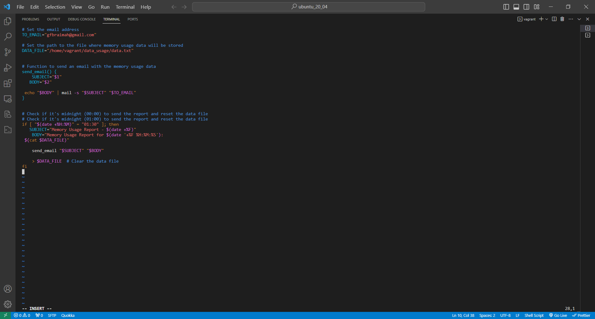
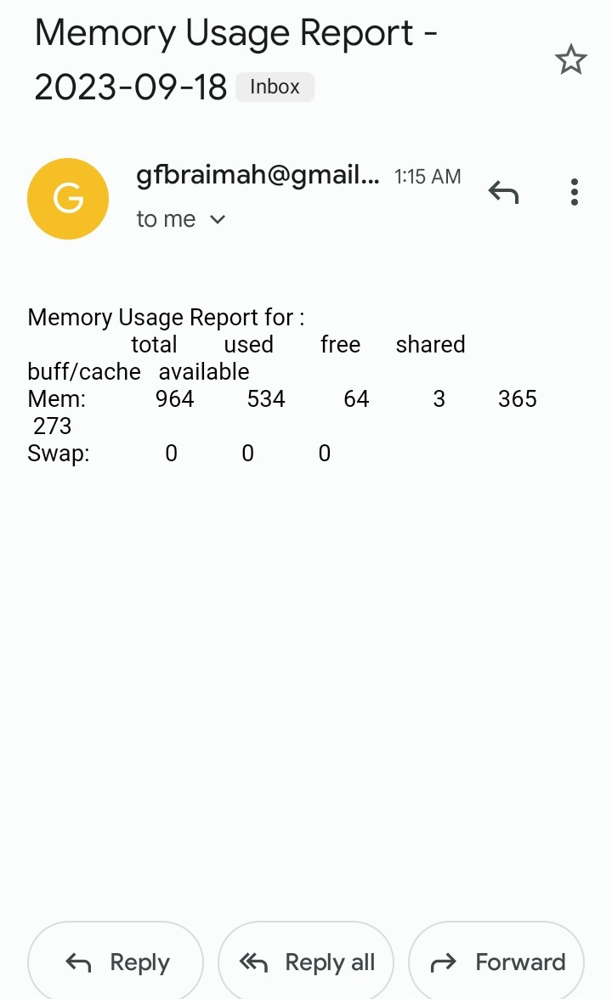

# Task: Create a bash script to run at every hour, saving system memory (RAM) usage to a specified file and at midnight it sends the content of the file to a specified email address, then starts over for the new day.

# Here is the bashscripts 

# Step 2 the crontab 

## The Original Plan: 12:00 AM

The initial intention was to schedule my scripts to run at midnight (12:00 AM). This timing was chosen for its convenience and to ensure that the scripts would not interfere with regular daytime activities. However, as i attempted to execute the scripts at this time, i encountered network-related problems.

## Adjusted Timing: 1:30 AM

In response to the network issues i experienced, i decided to adjust the timing of my script execution. I moved the schedule to 1:30 AM. This change allows me to work around network-related problems, as network traffic and interruptions tend to be lower during this time.

