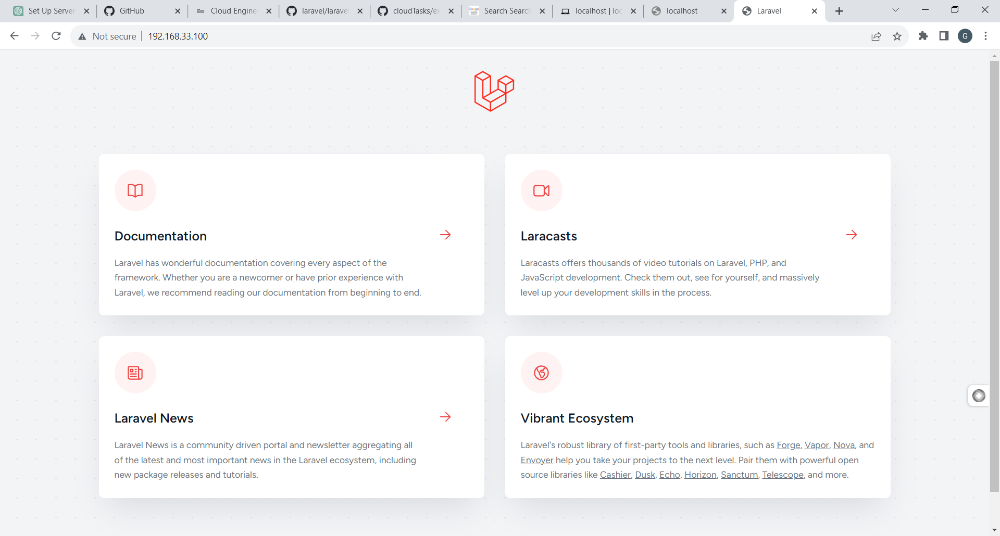

**Cloud Engineering Second Semester Examination Project**

**Objective**

Automate the provisioning of two Ubuntu-based servers, named "Master" and "Slave," using Vagrant. On the Master node, create a bash script to automate the deployment of a LAMP (Linux, Apache, MySQL, PHP) stack. This script should clone a PHP application from GitHub, install all necessary packages, and configure Apache web server and MySQL. Ensure the bash script is reusable and readable.

Using an Ansible playbook:
Execute the bash script on the Slave node and verify that the PHP application is accessible through the VM's IP address (take a screenshot of this as evidence).
Create a cron job to check the server's uptime every 12 am.

**Requirements**

- Submit the bash script and Ansible playbook to a publicly accessible GitHub repository.
- Document the steps with screenshots in md files, including proof of the application's accessibility (screenshots taken where necessary).
- Use either the VM's IP address or a domain name as the URL.
- PHP Laravel GitHub Repository: https://github.com/laravel/laravel

**Solutions**

**Automation.sh**

This script automates the process of setting up two virtual machines, "master" and "slave," with specific configurations, network settings, and required packages. You can use Vagrant to manage and deploy these virtual machines, which is particularly useful for development and testing environments. Make sure to execute this script in the directory where you want to create the Vagrant environment, and ensure that Vagrant and VirtualBox (or another supported provider) are installed on your system.

**Create Vagrantfile**

The script begins by generating a Vagrantfile, which is a configuration file for defining the virtual machine environment. It configures two virtual machines: "master" and "slave."

**Master Configuration**

The script configures the "master" virtual machine. It specifies the base box to be used (in this case, "ubuntu/focal64"). Assigns a private network IP address (192.168.33.100) to the "master." Allocates memory and CPU resources to the virtual machine. Defines provisioning steps for the "master" using a shell script. The shell script does the following:
- Generates an SSH key pair without a passphrase.
- Copies the SSH public key to the "slave" machine to enable passwordless SSH access.
- Updates and upgrades system packages.
- Installs the Avahi-Daemon and libnss-mdns packages.

**Slave Configuration**

Similar to the "master," the script configures the "slave" virtual machine. It specifies the base box, assigns a private network IP (192.168.33.101), allocates resources, and defines provisioning steps. The provisioning script for the "slave" ensures that the SSH server is installed, allows SSH password authentication for key copy, and restarts the SSH service. It also updates and upgrades system packages and installs the Avahi-Daemon and libnss-mdns packages.

**Vagrant Environment Initialization**

Finally, the script initializes and starts the Vagrant environment using the vagrant up command. This command reads the Vagrantfile and provisions the specified virtual machines.

**1. LARAVEL**

Laravel, often referred to as "The PHP Framework for Web Artisans," is truly a masterpiece in the world of web development. It's not just a framework; it's an elegant and sophisticated symphony of code that simplifies the complexities of building modern web applications.

Laravel brings joy to developers with its clean and expressive syntax, making code both readable and enjoyable to work on. It pampers developers with a plethora of built-in tools and features, from the powerful Eloquent ORM for database interactions to an intuitive Blade templating engine for crafting beautiful views.

This framework excels in crafting elegant and maintainable code, making it a favorite choice for both beginners and seasoned developers. Laravel's community support, along with its extensive documentation, ensures that every challenge is met with a helping hand.

**2. LAMP STACK**

Linux (Operating System): In this context, Linux serves as the operating system for your server. It provides the foundation for all other components of the stack to operate. Linux is a robust and stable operating system choice for web servers.

Apache (Web Server): Apache is a widely used open-source web server. It listens for incoming web requests and serves web pages and other content to users' browsers. In the context of Laravel, Apache is responsible for receiving HTTP requests and routing them to the Laravel application for processing.

MySQL (Database): MySQL is a popular open-source relational database management system. It is used to store, retrieve, and manage the application's data. Laravel can communicate with the MySQL database to perform operations like storing user data, content, and more.

PHP (Scripting Language): PHP is a server-side scripting language. Laravel is written in PHP and it runs on the server. PHP is responsible for processing user requests, interacting with the database, and generating dynamic web pages. Laravel leverages PHP to build web applications and manage web routes, controllers, views, and models.

**3. ANSIBLE**

Ansible, often described as a "simple, yet powerful" open-source automation tool, is a true game-changer in the world of IT operations and infrastructure management. This elegant and efficient automation platform provides a wide range of capabilities that simplify complex tasks, enhance productivity, and promote consistency across systems and networks.

**SECTIONS OF THE REPO**

The directory and files you've provided are part of an Ansible project that aims to automate the provisioning and configuration of two servers (referred to as "Master" and "Slave") and deploy a LAMP stack along with a Laravel application. Let's delve deeper into the purpose and content of each file:

**Ansible.cfg**

The ansible.cfg file contains configuration settings for Ansible. Here's what each setting means:

[defaults]: This section defines default configuration options.
- `inventory = inventory`: Specifies the inventory file to use. In this case, it points to an inventory file named "inventory."
- `private_key_file = ~/.ssh/id_rsa`: Specifies the SSH private key file to use for authentication. The `~` represents the user's home directory, and `~/.ssh/id_rsa` is the path to the private key.
- `host_key_checking = False`: Disables host key checking to prevent interactive prompts for new hosts.

**deploy.yaml**

The deploy.yaml file is an Ansible playbook. Playbooks describe a series of tasks to be executed on remote hosts. Here's a breakdown of the playbook's content:

- `hosts: all`: Indicates that these tasks should be executed on all hosts defined in the inventory.
- `become: true`: Specifies that Ansible should escalate privileges and run commands as a superuser (typically using sudo).
- `pre-tasks`: This section defines tasks that should be executed before the main tasks.
- `name: update & upgrade server`: Describes the first task, which updates and upgrades system packages using the apt module.
- `name: set cron job to check uptime of the server every 12 am`: Defines the second task, which uses the cron module to schedule a cron job for checking server uptime at midnight.
- `name: copy the bash scripts to the slave machine`: Describes the task for copying a bash script to the slave machine.
- `name: Set Execute Permissions on the Script`: Specifies a task for setting execute permissions on the copied script.
- `name: Run Bash Script`: Describes the final task, which runs a bash script (laravel-slave.sh) with specific arguments.

**inventory**

The inventory file defines the target hosts that Ansible will operate on. In this case, it contains the IP address 192.168.33.101, which is likely the IP address of your "Slave" machine. This file tells Ansible where to run the tasks defined in the playbook.

**file directory**

This directory contains bash script files, deploy.sh. It is used in the deployment process. Here's a brief description of deploy.sh:

deploy.sh is a bash script for automating the deployment of a LAMP stack and a Laravel application. It performs the following tasks:
- Installs essential packages.
- Configures the firewall (UFW).
- Installs and configures Apache.
- Installs MySQL and runs the MySQL secure installation script.
- Installs and configures PHP.
- Configures PHP settings.
- Installs Git and Composer.
- Configures Apache for Laravel.
- Clones the Laravel application from a GitHub repository.
- Sets Laravel permissions.
- Configures the Laravel .env file.
- Sets up the database for Laravel.

Overall, the ansible.cfg file configures Ansible settings, the deploy.yaml playbook defines tasks to be executed, the inventory file lists target hosts, and the file directory contains bash scripts used for server provisioning and application deployment.

This Ansible project automates the deployment and configuration of servers and a Laravel application, making it more efficient and reproducible. It's a powerful tool for infrastructure automation and application deployment.

**A proof of the deployments**



The "Master" VM is the control center that orchestrates and initiates the deployment process on both VMs. The "Slave" VM is the target system where the actual provisioning, configuration, and deployment tasks take place. Together, they work in tandem to achieve your goal of setting up a LAMP stack and deploying a Laravel application in an automated and reproducible manner. This approach makes it easier to scale and manage your server infrastructure and applications.

**How to run the scripts**
1. Create a folder 
```
  mkdir Laravel
```
3. Go into the folder
  ```
   cd Laravel
  ```
4. Create a file called Automation.sh then add the Automation.sh scripts on this repo
or Open the folder inside vscode then create a new file called Automation.sh then copy the scripts on the Automation.sh then paste it inside the Automation.sh script you have made
5. Open a new terminal and run the scripts
  ```
   ./Automation.sh
```
6. It will generate new vagrantfile then file then start up the machine 
 ```
    vagrant up
 ```
7. Now the machine has botted ssh into the master machine now
  ```
   vagrant ssh master
  ```
8. Then create a folder called Ansible-playbook and create a file called deploy.sh

  ```
   mkdir Ansible-playbook
  ```
   ```
     cd Ansible-playbook
   ```
  ```
      nano deploy.sh
  ```
after this copy the scripts inside the deploy.sh then paste it in your own

9. Give the script permissions
    ```
       sudo chmod u+x deploy.sh
    ```
10. Go ahead and run the script, but wait you will have to switch to the root user to run the scripts to avoid some permissions issues inside the scripts
  ```
     sudo su
  ```
11. Now go ahead and run the script
 ```
   ./deploy.sh
 ```

12. After running the script go ahead and paste the ipadresss on your browser then you should see PHP application there
13. Still inside the master the Ansible-playbook then create a new file called ansible.cfg
  ```
    vim ansible.cfg
```
Now paste the content you have inside this ansible.cfg inside your own 
14.  Create a new file called inventory 
   ``` 
   vim inventory
  ```
15. Now the last file we will create the playbook  
  ```
    vim delopy.yaml
  ```
Now paste the content you have inside this delopy.yaml inside your own 

16. Go back
 ```
  cd ..
```

17. Before we run the playbook we need to enable key based-authentication between the master and slave vm's
18. Generate an ssh key inside the master vm now
  ```
   ssh-keygen -t rsa -N "" -f ~/.ssh/id_rsa
```
19. Copy the keys to the slave vm authorised key file
 ```
   ssh-copy-id vagrant@192.168.33.101

 ```
20. After this exit or ctrl C
21. Log into the slave vm to Make sure that password-based authentication is allowed in the SSH server's configuration file (/etc/ssh/sshd_config). This line should be set to "yes":
 ```
    vagrant ssh slave
 ```
  ```
    sudo vim /etc/ssh/sshd_config
  ```
22. Scrol down and you will see 
  - PasswordAuthentication no
23. change it to yes 
   - PasswordAuthentication yes

24.  Restart the ssh service to apply changes

 ```
       sudo service ssh restart
    ```
24. Now go back to the master vm  first my exiting
 ```
    exit
```

 ```
   vagrant ssh master
```
25. Now test if its worked 
 ``` 
   ssh vagrant@192.168.33.101
 ``` 

26. if it worked then go ahead and run the playbook Make sure you are inside the "Ansible-playbook" directory on your "Master" VM:
```
  cd ~/Ansible-playbook
```
27. Run the Ansible playbook using the ansible-playbook command and specify the deploy.yaml playbook file:
```
   ansible-playbook deploy.yaml
```

